# Wireframes

Return to [README.md](../README.md)

---

1. Home page - before sign in

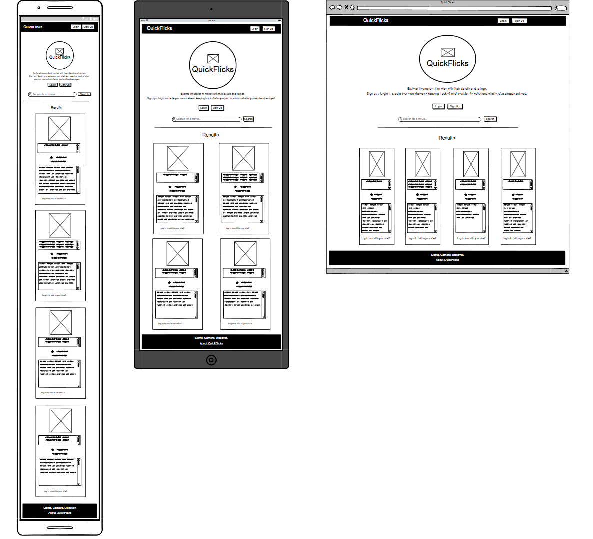

2. Home page - logged in

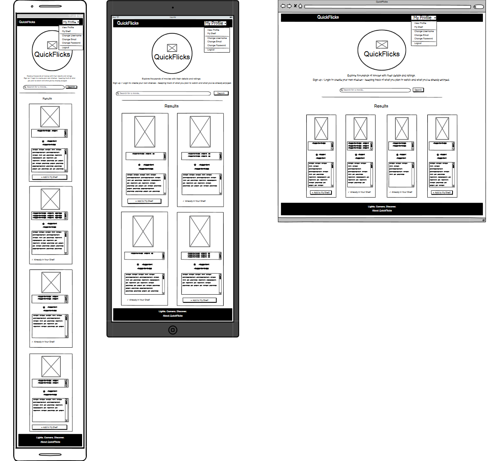

3. About page

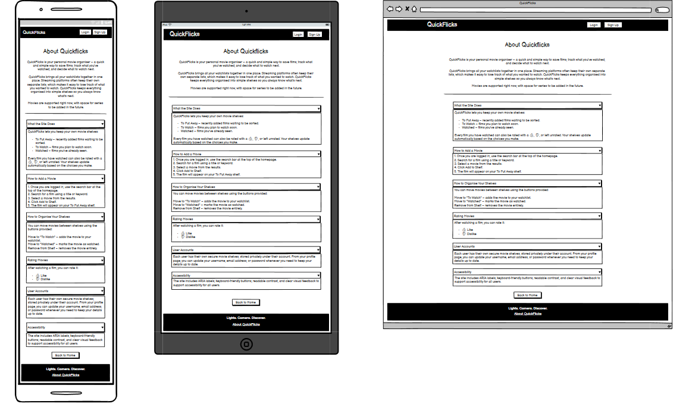

4. Login page

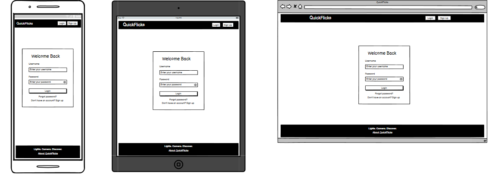

5. Sign up page

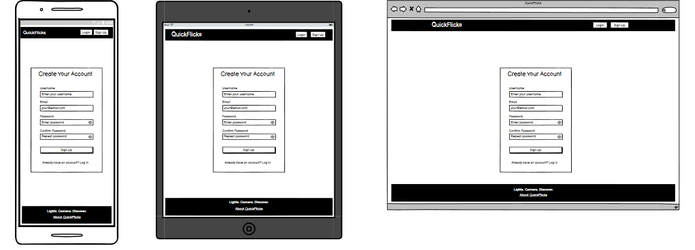

6. View profile page

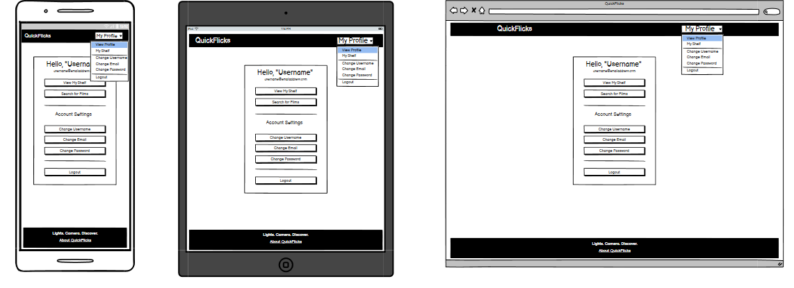

7. My shelf page - with films

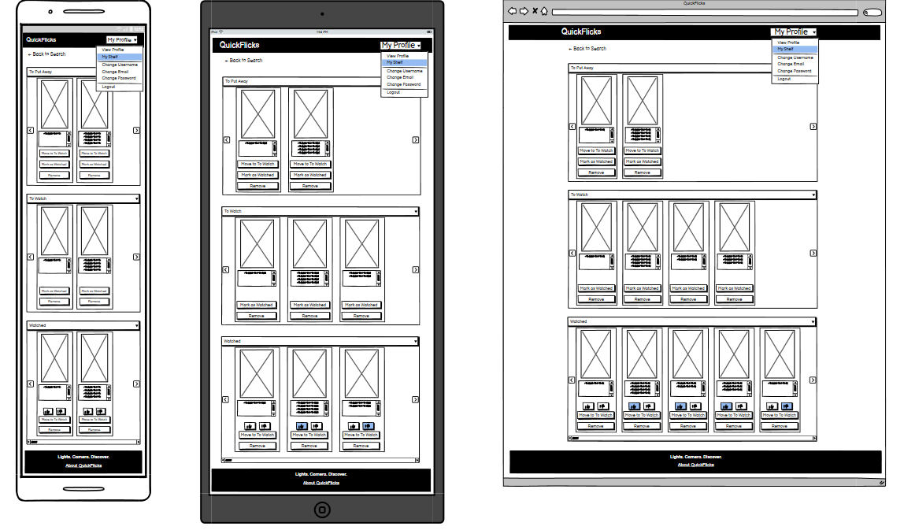

8. My shelf page - without films

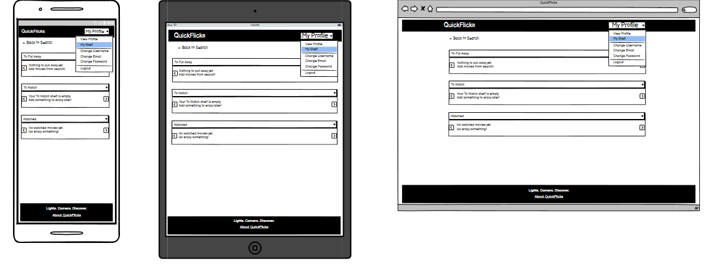

9. Change username page

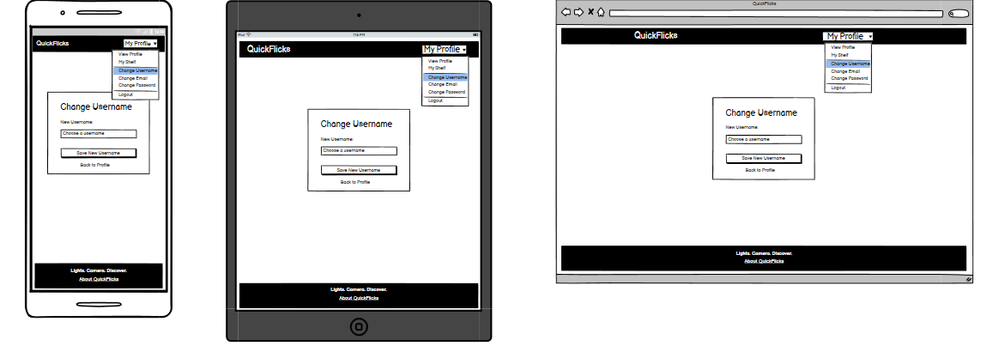

10. Change email page

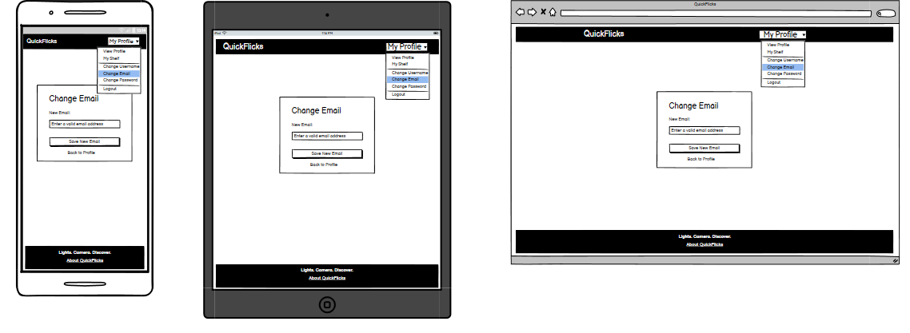

11. Change password page

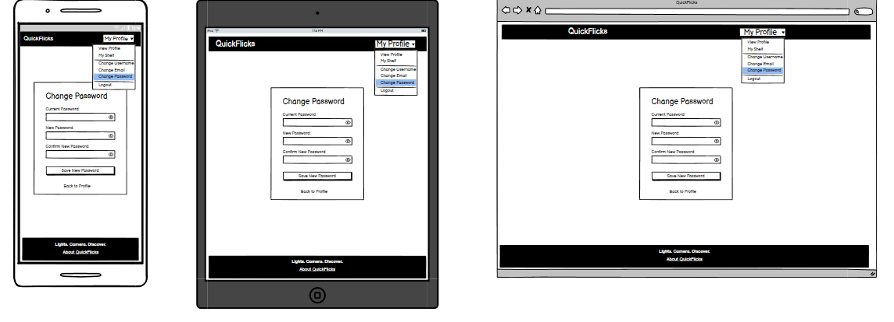

12. Password reset page (forgot password)

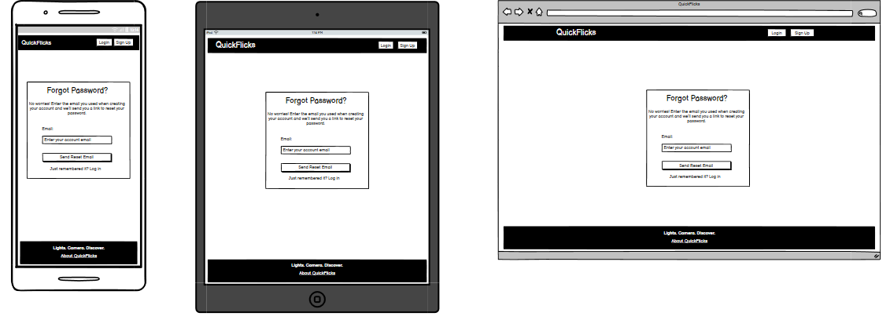

13. Password reset complete page (forgot password)

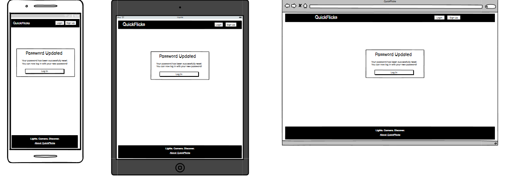

14. Password reset done page (forgot password)

15. Password reset confirm page - valid link, choose a new password (forgot password)

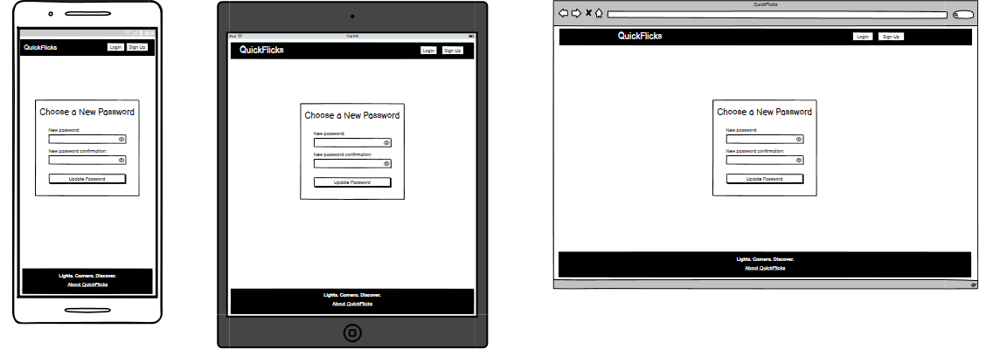

16. Password reset confirm page - invalid link (forgot password)

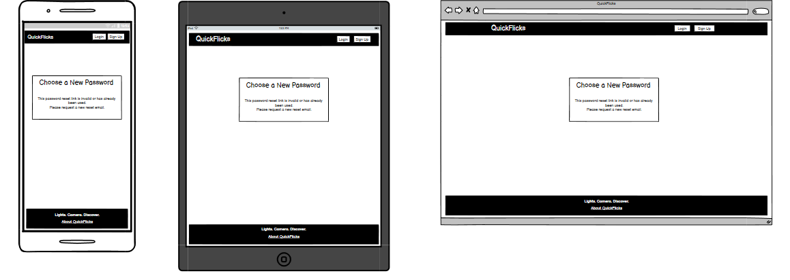

---
---

Return to [README.md](../README.md)